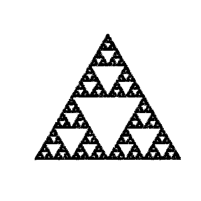

# fractals

A collection of R scripts which generate and plot mathematical fractals.

## Examples

Sierpinski triangle (gasket)

  

Fern

  

Tree

  

## Requirements

- R (≥ 4.0)
- Base R plotting functions (no external packages required)

